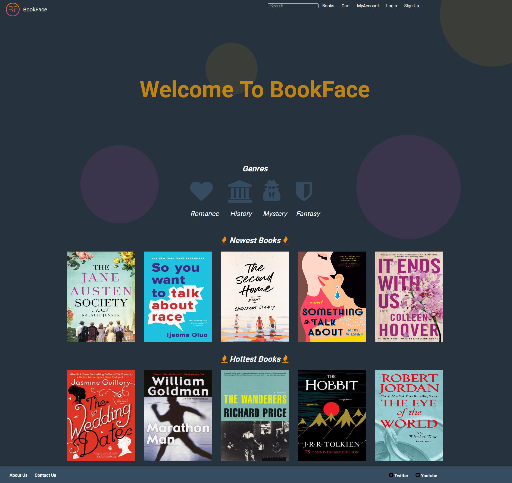

# BookStore

Project: Create a website that allows a user to:
Sign up 
login 
save account info 
update account info 
Order Books
Use promotions

Tools: Django, Postgresql, Python.
This project taught me alot about database management as well as connecting the frontend to the backend through the model view controller architectural style. 
In this case, model, template, view.

